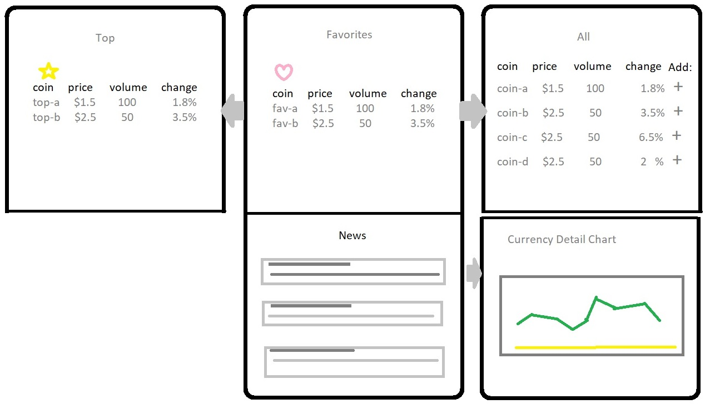

# Crypto Watcher

## Description
Quick access to top cryptocurrency rates. Explore news and more comprehensive list of currencies. Save coins to watchlist and add your current holdings for convenient rate updates and a portfolio total.

## Design
Bootstrap carousel layout. Default display is user portfolio or login screen. Left carousel item lists cryptocurrency news articles. Right carousel item displays list top coins and coin search.

### Project
Group Project at UCI Coding Bootcamp

#### Requirements:
- 2 APIs not previously used in class
- AJAX requests
- 1 library not previously used in class
- Mobile-first development
- Deploy to Firebase
  - Must have some persistent data
- User input validation
- 10 Minute presentation

#### APIs: 
- [CryptoCompare](https://min-api.cryptocompare.com/)
- [CNN News feed](https://newsapi.org/s/cnn-api)

#### Technologies: 
- [Bootstrap CSS library](https://getbootstrap.com/)
- [Accounting JS library](https://openexchangerates.github.io/accounting.js/)

#### Contributors:
Adam Openbrier
Amin Mansouri
Armando Pensado
Daniel Amini
